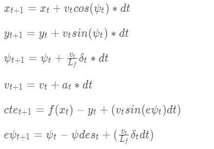

# Model Predictive Controller Project
Self-Driving Car Engineer Nanodegree Program

# Introduction

The goal of this project is to implement Model Predictive Control to drive the car around the track in Udacity-provided simulator, which communicates telemetry and track waypoint data via websocket, by sending steering and acceleration commands back to the simulator. The solution must be robust to 100ms latency, as one may encounter in real-world application. This solution makes use of [Ipopt](https://projects.coin-or.org/Ipopt/) and [CppAD](https://www.coin-or.org/CppAD/) libraries to calculate an optimal trajectory and its associated actuation commands in order to minimize error with a third-degree polynomial fit to the given waypoints. The optimization considers only a short duration's worth of waypoints, and produces a trajectory for that duration based upon a model of the vehicle's kinematics and a cost function based mostly on the vehicle's cross-track error (roughly the distance from the track waypoints) and orientation angle error, with other cost factors included to improve performance.

# Implementation steps

Following are the steps in this implementation to follow the trajectory along a line:

1. Set N and dt.
2. Fit the polynomial to the waypoints.
3. Calculate initial cross track error and orientation error values.
4. Define the components of the cost function (state, actuators, etc). 
5. Define the model constraints. These are the state update equations as shown below.

## The Model

The model includes vehicle's x and y coordinates, orientation angle (psi), velocity, cross-track error and psi error (epsi). Actuator outputs are acceleration and delta (steering angle). The model combines the state and actuations from the previous timestep to calculate the state for the current timestep based on the equations below:



Where dt is the timestep between predictions and Lf is the distance between the front and the center of gravity of the vehicle, which determines its turning radius.

## Timestep Length and Elapsed Duration (N & dt)

The final values chosen are 10 and 0.1 for N and dt respectively.

I started out with 20 steps at 0.05, tried with 8 steps at 0.1 and several other combinations and all of them resulted in an erratic behavior before settling down with 10 steps at 0.1, which means that the optimizer is considering a one second duration in which to determine a corrective trajectory. 

## Polynomial Fitting and MPC Preprocessing

The waypoints provided are transformed into vehicle's perspective (main.cpp lines 125-126). This simplifies the process to fit a polynomial to the waypoints because the vehicle's x and y coordinates are now at the origin (0, 0) and the orientation angle is also zero.

## Model Predictive Control with Latency

The latency is handled in two steps in this project. The actual equations depend upon the actuations from the previous timestep, but with a delay of 100ms, The actuations are applied another timestep later, so the equations have been altered to account for this (in MPC.cpp lines 119-122). Also, in addition to the cost functions suggested in the lessons an additional cost penalizing the combination of velocity and delta (MPC.cpp line 70) was included and this resulted in much more controlled cornering. This part of adding an additional cost is based on the suggestions from udacity slack community.

## Final result

Final result of the MPC implementation can be seen [here](https://youtu.be/uF1hT6e9Gi4)

---

## Dependencies

* cmake >= 3.5
 * All OSes: [click here for installation instructions](https://cmake.org/install/)
* make >= 4.1(mac, linux), 3.81(Windows)
  * Linux: make is installed by default on most Linux distros
  * Mac: [install Xcode command line tools to get make](https://developer.apple.com/xcode/features/)
  * Windows: [Click here for installation instructions](http://gnuwin32.sourceforge.net/packages/make.htm)
* gcc/g++ >= 5.4
  * Linux: gcc / g++ is installed by default on most Linux distros
  * Mac: same deal as make - [install Xcode command line tools]((https://developer.apple.com/xcode/features/)
  * Windows: recommend using [MinGW](http://www.mingw.org/)
* [uWebSockets](https://github.com/uWebSockets/uWebSockets)
  * Run either `install-mac.sh` or `install-ubuntu.sh`.
  * If you install from source, checkout to commit `e94b6e1`, i.e.
    ```
    git clone https://github.com/uWebSockets/uWebSockets
    cd uWebSockets
    git checkout e94b6e1
    ```
    Some function signatures have changed in v0.14.x. See [this PR](https://github.com/udacity/CarND-MPC-Project/pull/3) for more details.

* **Ipopt and CppAD:** Please refer to [this document](https://github.com/udacity/CarND-MPC-Project/blob/master/install_Ipopt_CppAD.md) for installation instructions.
* [Eigen](http://eigen.tuxfamily.org/index.php?title=Main_Page). This is already part of the repo so you shouldn't have to worry about it.
* Simulator. You can download these from the [releases tab](https://github.com/udacity/self-driving-car-sim/releases).
* Not a dependency but read the [DATA.md](./DATA.md) for a description of the data sent back from the simulator.


## Basic Build Instructions

1. Clone this repo.
2. Make a build directory: `mkdir build && cd build`
3. Compile: `cmake .. && make`
4. Run it: `./mpc`.

## Tips

1. It's recommended to test the MPC on basic examples to see if your implementation behaves as desired. One possible example
is the vehicle starting offset of a straight line (reference). If the MPC implementation is correct, after some number of timesteps
(not too many) it should find and track the reference line.
2. The `lake_track_waypoints.csv` file has the waypoints of the lake track. You could use this to fit polynomials and points and see of how well your model tracks curve. NOTE: This file might be not completely in sync with the simulator so your solution should NOT depend on it.
3. For visualization this C++ [matplotlib wrapper](https://github.com/lava/matplotlib-cpp) could be helpful.)
4.  Tips for setting up your environment are available [here](https://classroom.udacity.com/nanodegrees/nd013/parts/40f38239-66b6-46ec-ae68-03afd8a601c8/modules/0949fca6-b379-42af-a919-ee50aa304e6a/lessons/f758c44c-5e40-4e01-93b5-1a82aa4e044f/concepts/23d376c7-0195-4276-bdf0-e02f1f3c665d)
5. **VM Latency:** Some students have reported differences in behavior using VM's ostensibly a result of latency.  Please let us know if issues arise as a result of a VM environment.

## Editor Settings

We've purposefully kept editor configuration files out of this repo in order to
keep it as simple and environment agnostic as possible. However, we recommend
using the following settings:

* indent using spaces
* set tab width to 2 spaces (keeps the matrices in source code aligned)

## Code Style

Please (do your best to) stick to [Google's C++ style guide](https://google.github.io/styleguide/cppguide.html).
